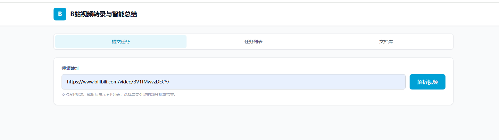
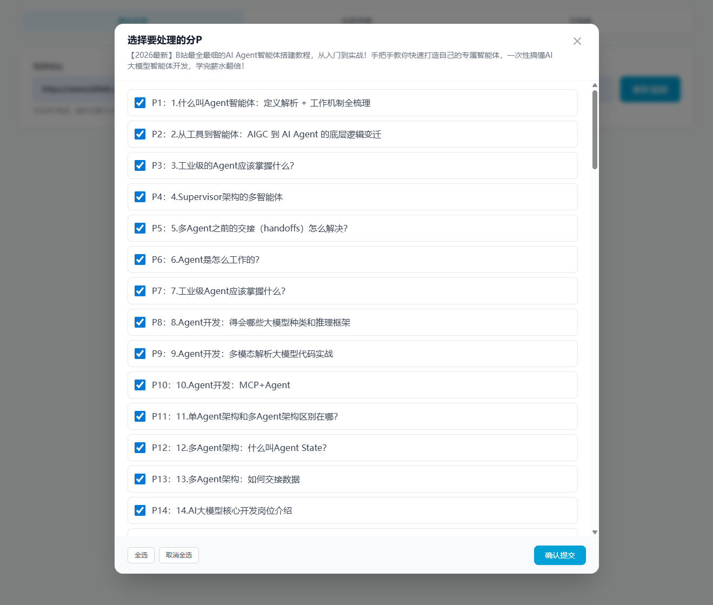
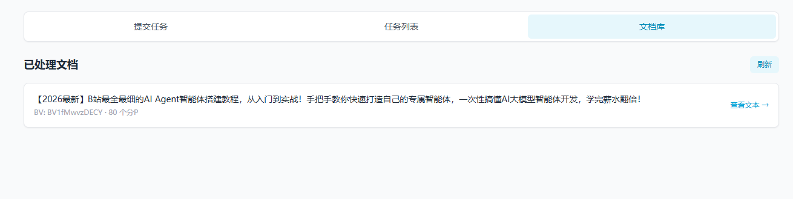
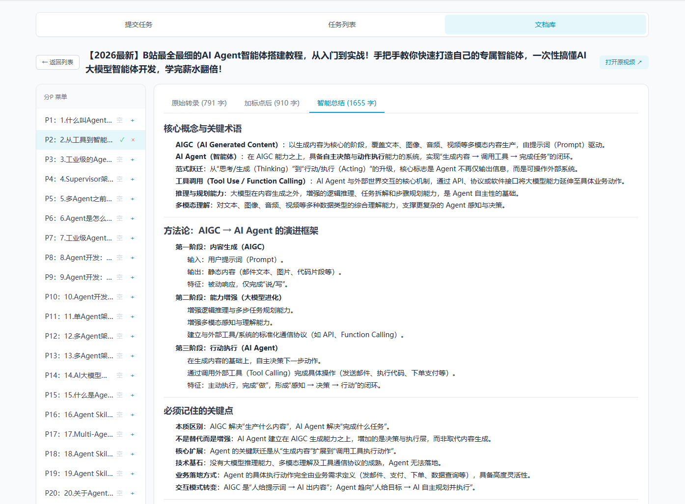

# bili2text — B站视频转录与智能总结系统

<p align="center">
  
  
  
  
  
</p>

<p align="center">
  <b>一键将 B站视频转为高质量文字稿 + AI 智能总结</b><br>
  <i>基于 FastAPI + OpenAI Whisper + LLM，支持 SSE 实时进度推送</i>
</p>

---

## ✨ 功能特性

- 🎬 **B站视频解析** — 输入视频链接，自动获取视频信息（标题、分 P、CID 等）
- 🎵 **音频自动下载** — 自动提取视频音轨，支持多 P 批量下载
- 🎯 **Whisper 语音转录** — 基于 OpenAI Whisper 模型，支持中文普通话高精度识别，自动输出简体中文
- ✍️ **AI 智能标点** — 使用 LLM 为原始转录文本添加合适的中文标点、分段和 Markdown 小标题
- 📝 **AI 内容总结** — 针对教程类内容，自动提取核心概念、方法论、关键知识点和面试考点
- 🌐 **Web UI + API** — 提供浏览器界面

## 🖼️ 在线演示

<table>
  <tr>
    <td align="center">
      <br>
      <sub>Web UI 首页 — 输入视频链接即可开始</sub>
    </td>
    <td align="center">
      <br>
      <sub>任务列表 — 实时查看所有处理任务</sub>
    </td>
  </tr>
  <tr>
    <td align="center">
      <br>
      <sub>SSE 实时推送 — 进度一目了然</sub>
    </td>
    <td align="center">
      <br>
      <sub>结果展示 — 原文、标点文本、总结三栏对比</sub>
    </td>
  </tr>
</table>

## 🚀 快速开始

### 环境要求

- Python 3.10+
- FFmpeg（Whisper 依赖）
- 至少 4GB 可用内存（Whisper 模型加载）
- OpenAI 兼容的 LLM API Key（Kimi、DeepSeek、OpenAI 等）

### 1. 克隆仓库

```bash
git clone https://github.com/yourusername/bili2text.git
cd bili2text
```

### 2. 安装依赖

本项目依赖来自父项目虚拟环境（`.venv`），请确保虚拟环境已激活：

```bash
# 创建并激活虚拟环境（如尚未创建）
python -m venv .venv
source .venv/bin/activate  # Linux/Mac
# .venv\Scripts\activate  # Windows

# 安装核心依赖
pip install -r requirements.txt
```

### 3. 配置环境变量

创建 `.env` 文件：

```env
# LLM API 配置（支持任意 OpenAI 兼容接口）
LLM_API_KEY=your_api_key_here
LLM_BASE_URL=https://api.openai.com/v1
LLM_MODEL=gpt-4

# 可选：配置多个模型用于不同任务
# PUNCTUATION_MODEL=deepseek-v4-flash
# SUMMARY_MODEL=kimi-k2.6
```

### 4. 启动服务

```bash
uvicorn main:app --reload
```

服务将在 `http://127.0.0.1:8000` 启动。

- **Web UI**: 访问 `http://127.0.0.1:8000/`
- **健康检查**: `http://127.0.0.1:8000/health`


## 🏗️ 架构设计

### 分层架构

```
presentation/     ← HTTP 路由、Web UI、异常处理
    ├── api/           API 端点（submit, status, stream）
    ├── templates/     Jinja2 模板
    └── dependencies.py  依赖注入容器（手工 DI，非 FastAPI 内置）

application/      ← 应用服务、用例编排
    ├── use_cases.py   业务用例（解析、处理、查询）
    └── dto.py         数据传输对象

domain/           ← 核心业务逻辑（零外部依赖！）
    ├── models.py      数据模型
    ├── ports.py       端口定义（抽象接口）
    └── repositories.py 仓储接口

infrastructure/   ← 技术实现
    ├── adapters/      端口适配器（下载、语音识别、LLM）
    ├── external/      外部服务客户端
    ├── repositories.py 仓储实现（TinyDB、内存）
    └── config.py      配置管理
```

### 处理流水线

```
用户提交视频链接
      │
      ▼
[解析URL] ──→ 获取视频信息（标题、分P）
      │
      ▼
[创建任务] ──→ ProcessingTask（内存存储）
      │
      ▼
[下载音频] ──→ 按 CID 存储为 MP3
      │
      ▼
[Whisper转录] ──→ 原始文本（简体中文）
      │
      ▼
[LLM标点] ──→ 加标点、分段、Markdown标题
      │
      ▼
[LLM总结] ──→ 核心概念、方法论、面试提示
      │
      ▼
[完成] ──→ 所有产物存储到 ./storage/
```


## ⚙️ 配置说明

### LLM 模型配置

在 `infrastructure/config.py` 中配置 LLM 模型：

```python
LLM_CFG = {
    'kimi-k2.6': {
        'api_key': os.getenv('LLM_API_KEY'),
        'base_url': os.getenv('LLM_BASE_URL'),
        'model': 'kimi-k2.6',
    },
    'deepseek-v4-flash': {
        'api_key': os.getenv('LLM_API_KEY'),
        'base_url': os.getenv('LLM_BASE_URL'),
        'model': 'deepseek-v4-flash',
    },
}
```

当前策略：
- **标点任务**：使用轻量级模型（如 DeepSeek-V4-Flash），成本低、响应快
- **总结任务**：使用强模型（如 Kimi-K2.6），确保总结质量


### Whisper 模型选择

在 `infrastructure/adapters/SpeechAdapter.py` 中配置：

```python
# 可选模型：tiny, base, small, medium, large
# 精度与速度权衡：tiny（最快）→ large（最准）
speech_model = {
    'tiny': None,   # ~1GB 内存，适合快速测试
    'small': None,  # ~2GB 内存，平衡选择
}
```

## 🛠️ 技术栈

| 技术 | 用途 |
|------|------|
| [FastAPI](https://fastapi.tiangolo.com/) | 高性能 Web 框架 |
| [OpenAI Whisper](https://github.com/openai/whisper) | 语音识别与转录 |
| [Pydantic](https://docs.pydantic.dev/) | 数据验证与序列化 |
| [Jinja2](https://jinja.palletsprojects.com/) | 模板引擎（Web UI） |
| [TinyDB](https://tinydb.readthedocs.io/) | 轻量级 JSON 数据库 |
| [uvicorn](https://www.uvicorn.org/) | ASGI 服务器 |

## 📝 应用场景

- 📚 **学习笔记** — 将 B站教程视频转为文字稿，方便做笔记和复习
- 🔍 **内容检索** — 为视频内容建立全文索引，快速定位知识点
- 📝 **文章创作** — 基于视频内容生成结构化文章或博客
- 🎓 **知识管理** — 构建个人视频知识库，配合 Obsidian/Notion 使用
- 🤖 **二次开发** — 基于本项目的 API 和架构，构建更复杂的视频处理工作流


## 📄 许可证

[MIT](LICENSE) © yourname

---

<p align="center">
  如果这个项目对你有帮助，请给个 ⭐ Star！<br>
  <sub>Keywords: B站视频转文字, Bilibili transcription, Whisper 语音识别, AI 视频总结, FastAPI, DDD 架构, SSE 实时推送, OpenAI 兼容, 视频转录, 语音转文本, Python 视频处理</sub>
</p>
