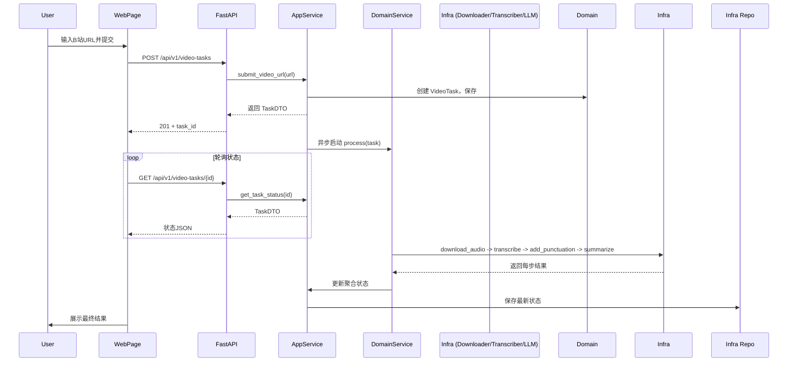

# 设计文档：B站视频音频提取与智能文本处理系统

## 1. 概述

本系统提供一个基于 FastAPI 的 Web 交互页面，用户输入 B 站视频地址后，系统自动完成以下流程：

1. 下载视频的音频轨道
2. 调用 Whisper 将音频转录为原始文本
3. 调用大语言模型（LLM）为原始文本添加标点符号
4. 再次调用 LLM 对加标点后的文本进行摘要总结

系统采用**领域驱动设计（DDD）** 的分层架构，将核心业务逻辑与外部技术实现解耦，保证代码的可维护性、可测试性和可扩展性。

---

## 2. 架构总览

系统遵循经典的**端口-适配器（六边形）架构**，分层如下：

```
┌─────────────────────────────────────────────────────────────┐
│                    用户界面层 (Presentation)                 │
│            FastAPI Web 页面 + REST API 端点                  │
├─────────────────────────────────────────────────────────────┤
│                       应用层 (Application)                   │
│             VideoProcessingAppService（用例协调）            │
├─────────────────────────────────────────────────────────────┤
│                        领域层 (Domain)                       │
│   ┌──────────┐  ┌──────────────┐  ┌──────────────────────┐  │
│   │ 实体/聚合 │  │  领域服务     │  │      端口接口        │  │
│   │VideoTask │  │VideoProcessing│  │DownloaderPort       │  │
│   │Transcript│  │   Service     │  │TranscriberPort      │  │
│   │Summary   │  │               │  │LlmClientPort        │  │
│   │VideoURL  │  │               │  │VideoTaskRepository  │  │
│   └──────────┘  └──────────────┘  └──────────────────────┘  │
├─────────────────────────────────────────────────────────────┤
│                     基础设施层 (Infrastructure)              │
│  BiliBiliDownloader | WhisperTranscriber | OpenAiLlmClient │
│  InMemoryRepository | SqlAlchemyRepository                 │
└─────────────────────────────────────────────────────────────┘
```

- **用户界面层**：负责 HTTP 请求响应和页面渲染，调用应用层服务。
- **应用层**：编排领域服务与基础设施，处理事务、安全等横切关注点，不含业务逻辑。
- **领域层**：包含核心业务概念和规则，定义接口（端口），不依赖任何外部框架。
- **基础设施层**：实现领域层定义的端口，封装对具体工具（yt-dlp、Whisper、OpenAI API、数据库）的调用。

---

## 3. 领域模型设计

### 3.1 聚合根：VideoTask

`VideoTask` 是整个处理流程的聚合根，它记录了从 B 站 URL 到最终摘要的全部状态和产物。

**属性**：

| 字段              | 类型        | 说明                               |
|-------------------|-------------|------------------------------------|
| id                | TaskId (VO) | 任务唯一标识                       |
| video_url         | VideoURL    | 用户输入的 B 站视频地址            |
| status            | TaskStatus  | 当前状态（枚举）                   |
| audio_path        | str         | 下载后的音频文件路径               |
| raw_transcript    | Transcript  | Whisper 输出原始文本               |
| punctuated_text   | PunctuatedText | LLM 加标点后的文本             |
| summary           | Summary     | LLM 生成的摘要                     |
| error_message     | str         | 失败时的错误信息                   |
| created_at        | datetime    | 创建时间                           |
| updated_at        | datetime    | 最后更新时间                       |

**状态枚举**：

- `CREATED` – 任务刚刚创建
- `DOWNLOADING` – 正在下载音频
- `DOWNLOADED` – 音频下载完成
- `TRANSCRIBING` – 正在转录
- `TRANSCRIBED` – 转录完成
- `PUNCTUATING` – 正在加标点
- `PUNCTUATED` – 加标点完成
- `SUMMARIZING` – 正在总结
- `COMPLETED` – 全部完成
- `FAILED` – 处理失败

**行为**：
- `start_downloading()`, `finish_download(path)`
- `start_transcribing()`, `finish_transcription(raw_text)`
- `start_punctuating()`, `finish_punctuation(text)`
- `start_summarizing()`, `finish_summary(text)`
- `fail(error_msg)`

### 3.2 值对象

- **VideoURL**：封装 B 站视频链接，提供合法性校验。
- **Transcript**：不可变文本对象，包含原始转录文字。
- **PunctuatedText**：加标点后的文本。
- **Summary**：摘要文本。
- **TaskId**：UUID 格式的任务标识。

这些值对象都属于 `VideoTask` 聚合的一部分，生命周期由聚合根管理。

### 3.3 端口接口（领域层抽象）

| 端口                     | 职责                                   |
|--------------------------|----------------------------------------|
| `DownloaderPort`         | `download_audio(video_url: VideoURL) -> AudioFile` |
| `TranscriberPort`        | `transcribe(audio: AudioFile) -> Transcript`      |
| `LlmClientPort`          | `add_punctuation(raw: Transcript) -> PunctuatedText` <br> `summarize(text: PunctuatedText) -> Summary` |
| `VideoTaskRepository`    | `save(task: VideoTask)` <br> `find_by_id(task_id: TaskId) -> Optional[VideoTask]` |

### 3.4 领域服务：VideoProcessingService

领域服务负责处理整个视频转文本及智能分析的流水线。它依赖上述端口，实现核心业务规则，例如：

- 同一视频 URL 在短期内不重复处理（幂等性，可选）
- 下载失败时记录错误并中止后续步骤
- 任意步骤失败后，任务状态标记为 `FAILED`，并保存错误信息

核心方法：

```python
class VideoProcessingService:
    def __init__(self, downloader: DownloaderPort, transcriber: TranscriberPort,
                 llm: LlmClientPort, repo: VideoTaskRepository):
        ...

    async def process(self, task: VideoTask) -> VideoTask:
        """按序执行流水线，每一步失败即中止并更新状态。"""
        try:
            # 1. 下载
            task.start_downloading()
            self.repo.save(task)
            audio = await self.downloader.download_audio(task.video_url)
            task.finish_download(audio.path)
          
            # 2. 转录
            task.start_transcribing()
            self.repo.save(task)
            raw = await self.transcriber.transcribe(audio)
            task.finish_transcription(raw)
          
            # 3. 加标点
            task.start_punctuating()
            self.repo.save(task)
            punctuated = await self.llm.add_punctuation(raw)
            task.finish_punctuation(punctuated)
          
            # 4. 总结
            task.start_summarizing()
            self.repo.save(task)
            summary = await self.llm.summarize(punctuated)
            task.finish_summary(summary)
          
            self.repo.save(task)
            return task
        except Exception as e:
            task.fail(str(e))
            self.repo.save(task)
            return task
```

---

## 4. 应用层设计

应用层负责接收来自用户界面的命令，创建任务、触发领域服务，并返回 DTO（数据传输对象）给表示层。

核心应用服务：`VideoProcessingAppService`

```python
class VideoProcessingAppService:
    def __init__(self, repo: VideoTaskRepository, processing: VideoProcessingService):
        ...

    async def submit_video_url(self, url_str: str) -> VideoTaskDTO:
        # 1. 创建 VideoTask 聚合根
        video_url = VideoURL(url_str)
        task = VideoTask.create(video_url)
        self.repo.save(task)
      
        # 2. 异步启动处理（可使用后台任务，避免阻塞请求）
        asyncio.create_task(self.processing.process(task))
      
        # 3. 返回任务 ID 与初始状态
        return VideoTaskDTO.from_entity(task)

    async def get_task_status(self, task_id: str) -> VideoTaskDTO:
        task = self.repo.find_by_id(TaskId(task_id))
        if not task:
            raise TaskNotFoundException
        return VideoTaskDTO.from_entity(task)
```

DTO 用于隔离领域实体与外部接口，只暴露必要的字段。

---

## 5. 基础设施层设计

### 5.1 下载器实现

使用 `yt-dlp` 库下载 B 站视频音频。封装为 `BiliBiliDownloader`，实现 `DownloaderPort`。

- 输入：`VideoURL` 值对象
- 输出：`AudioFile` 数据类（包含文件路径、格式）
- 错误处理：下载超时、无效 URL 等均转换为自定义 `DownloadException`

### 5.2 转录器实现

使用 `faster-whisper` 或 OpenAI Whisper API。实现 `WhisperTranscriber`，遵循 `TranscriberPort`。

- 输入：`AudioFile`
- 输出：`Transcript` 值对象
- 支持本地模型或远程 API，可配置

### 5.3 LLM 客户端实现

使用 `openai` Python 库调用 ChatGPT 等模型。实现 `OpenAiLlmClient`，遵循 `LlmClientPort`。

- `add_punctuation`：系统提示词指定“请为以下无标点文本添加合适的标点符号”，返回 `PunctuatedText`
- `summarize`：系统提示词指定“请用简洁的语言总结以下文本”，返回 `Summary`
- 可配置模型名称、温度等参数

### 5.4 仓储实现

- **内存仓储**（开发/测试）：基于字典的简单实现
- **数据库仓储**（生产）：使用 SQLAlchemy 映射 `VideoTask` 到关系表，通过 ORM 实现 `VideoTaskRepository`

---

## 6. 表示层设计（FastAPI 页面与 API）

### 6.1 Web 页面

- 路径：`GET /`
- 返回一个简单的 HTML 表单，包含视频 URL 输入框和提交按钮。
- 前端使用服务端渲染或轻量 JavaScript（如 htmx 或 fetch API）实现异步提交与轮询。
- 提交后页面显示任务进度（状态列表）及最终结果（原始转录、加标点文本、摘要）。

### 6.2 REST API 端点

| 方法   | 路径                          | 描述                   |
|--------|-------------------------------|------------------------|
| POST   | `/api/v1/video-tasks`         | 创建视频处理任务        |
| GET    | `/api/v1/video-tasks/{id}`    | 查询任务状态与结果      |

**POST /api/v1/video-tasks**

请求体：
```json
{
  "video_url": "https://www.bilibili.com/video/BV1xxxxxxx"
}
```

响应 (201)：
```json
{
  "task_id": "uuid",
  "status": "CREATED",
  "video_url": "...",
  "created_at": "..."
}
```

**GET /api/v1/video-tasks/{id}**

响应 (200)：
```json
{
  "task_id": "uuid",
  "status": "COMPLETED",
  "audio_downloaded": true,
  "raw_transcript": "...",
  "punctuated_text": "...",
  "summary": "...",
  "error_message": null
}
```

### 6.3 异步处理与状态推送

为了提供较好的用户体验，处理流程采用后台任务（FastAPI `BackgroundTasks` 或独立任务队列如 Celery）。前端每 2 秒轮询一次任务状态，直到 `status` 变为 `COMPLETED` 或 `FAILED`，然后展示结果。也可选用 WebSocket 实时推送状态变化。

---

## 7. 关键流程时序图



---

## 8. 错误处理策略

- 每个步骤捕获异常，通过 `task.fail(msg)` 置为失败态，并立即中止后续步骤。
- 错误信息持久化到数据库，方便排查。
- 前端根据 `status == FAILED` 显示错误信息，可引导用户重试（重新提交同一 URL 将创建新任务）。
- 为保障幂等性，可对相同的 `video_url` + `CREATED` 状态的任务去重（可选设计）。

---

## 9. 扩展性设计

- **任务队列替换**：`VideoProcessingAppService` 的 `asyncio.create_task` 可轻松替换为 Celery 或 RQ 生产者，只需实现一个简单的任务调度器端口。
- **LLM 厂商替换**：通过 `LlmClientPort` 接口，可无缝切换 OpenAI、文心一言、ChatGLM 等多种实现。
- **多格式输出支持**：可扩展 `VideoTask` 增加字幕文件导出（.srt）等产物。
- **可观测性**：所有领域事件均可发布为消息，供日志、监控系统消费。

---

## 10. 部署与运行说明

1. 安装依赖：`fastapi, uvicorn, yt-dlp, openai, faster-whisper, jinja2` 等。
2. 配置环境变量：`OPENAI_API_KEY`, `WHISPER_MODEL_SIZE` (base/small/medium/large)，音频存储路径。
3. 启动服务：`uvicorn presentation.main:app --host 0.0.0.0 --port 8000`
4. 访问 `http://localhost:8000` 即可使用。

---

## 11. 目录结构
基于 DDD 架构，推荐的项目目录结构如下：

```
bilibili-video-transcriber/
├── README.md
├── requirements.txt
├── .env                          # 环境变量（OPENAI_API_KEY 等）
├── src/
│   ├── __init__.py
│   ├── presentation/             # 用户界面层
│   │   ├── __init__.py
│   │   ├── main.py               # FastAPI 应用入口，挂载路由、静态文件、模板
│   │   ├── api/
│   │   │   ├── __init__.py
│   │   │   ├── routes.py         # 定义 REST API 端点
│   │   │   └── dto.py            # 数据传输对象（与领域模型隔离）
│   │   └── web/
│   │       ├── __init__.py
│   │       ├── templates/        # Jinja2 模板
│   │       │   └── index.html    # 主页面（输入框、进度展示）
│   │       └── static/           # 静态资源（css/js）
│   │           └── app.js
│   │
│   ├── application/              # 应用层
│   │   ├── __init__.py
│   │   └── video_processing_app_service.py  # 用例编排、事务管理
│   │
│   ├── domain/                   # 领域层
│   │   ├── __init__.py
│   │   ├── models/               # 实体、聚合根、值对象
│   │   │   ├── __init__.py
│   │   │   ├── video_task.py     # VideoTask 聚合根，包含行为方法
│   │   │   └── value_objects.py  # VideoURL, Transcript, PunctuatedText, Summary, TaskId
│   │   ├── services/             # 领域服务
│   │   │   ├── __init__.py
│   │   │   └── video_processing_service.py  # 核心流水线逻辑
│   │   └── ports/                # 端口接口（抽象）
│   │       ├── __init__.py
│   │       ├── downloader_port.py
│   │       ├── transcriber_port.py
│   │       ├── llm_client_port.py
│   │       └── video_task_repository.py
│   │
│   └── infrastructure/           # 基础设施层
│       ├── __init__.py
│       ├── config.py             # 从环境变量读取配置
│       ├── downloader/
│       │   ├── __init__.py
│       │   ├── bilibili_downloader.py    # yt-dlp 实现 DownloaderPort
│       │   └── downloads/               # 音频文件存放目录
│       ├── transcriber/
│       │   ├── __init__.py
│       │   └── whisper_transcriber.py   # faster-whisper 实现 TranscriberPort
│       ├── llm/
│       │   ├── __init__.py
│       │   └── openai_llm_client.py     # OpenAI API 实现 LlmClientPort
│       └── repositories/
│           ├── __init__.py
│           ├── in_memory_repository.py  # 开发/测试用内存仓储
│           └── sqlalchemy_repository.py # 生产用 ORM 仓储
│
└── tests/
    ├── __init__.py
    ├── unit/
    │   ├── domain/
    │   └── application/
    └── integration/
        └── test_api.py
```

**目录职责说明**：
- `presentation/main.py` 装配依赖注入（手动或依赖注入框架），创建应用实例。
- `application/video_processing_app_service.py` 接收命令（提交URL），创建领域对象，触发领域服务，并将领域实体转换为 DTO 返回给表示层。
- `domain/models` 包含纯 POJO/数据类，不依赖任何框架。
- `domain/ports` 定义接口，所有外部依赖都由这些端口抽象。
- `infrastructure` 下的每个模块负责实现一个端口，可以灵活替换（如切换成阿里云 Whisper 或本地模型）。
- `downloads/` 属于运行时产生的文件，应加入 `.gitignore`。

这种结构保证了各层之间的单向依赖（表示层 → 应用层 → 领域层；基础设施层实现领域层端口），完全符合 DDD 的依赖倒置原则。

## 11. 总结

本设计通过 DDD 的分层与端口-适配器模式，实现了核心业务逻辑与外部工具的彻底解耦。前端仅通过 REST API 与应用层交互，领域层定义了清晰的聚合、值对象和领域服务，基础设施层提供了可替换的适配器实现。系统具备高可维护性和可扩展性，能够适应未来底层工具的变更和业务需求的演进。